# 📊 Excel-4


## ✨ Project Description

**Excel-4** shows practical examples of data validation in Excel. Here you'll find tips, instructions, and illustrations about validating data and creating drop-down tables.

> 📚 **Goal:** Help you validate and control data input in Excel efficiently—suitable for both beginners and advanced users!

---

## 📒 Table of Contents

- [Data Validation](#-data-validation)
- [Budget Limit Example](#-budget-limit-example)
- [Prevent Duplicates Example](#-prevent-duplicates-example)
- [Drop-down Lists](#-drop-down-lists)
- [Screenshots](#-screenshots)
- [Requirements](#-requirements)
- [Author](#-author)

---

## ✅ Data Validation

In this example, we will check whether the entered value is between 1 and 10.

1. Select cell **B1**.
2. On the **Data** tab, in the **Data Tools** group, click **Data Validation**.
3. On the Settings tab:
   - In the Allow list, click **Whole number**.
   - In the Data list, click **between**.
   - Enter Maximum and Minimum values.
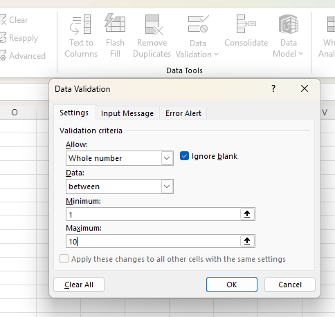

**Input Message window:**  
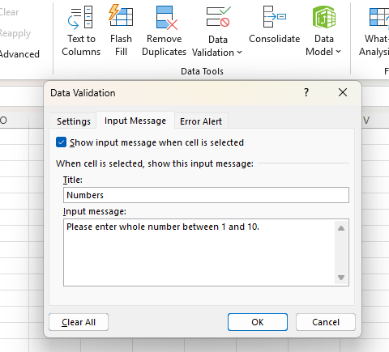

**Error Alert window:**  
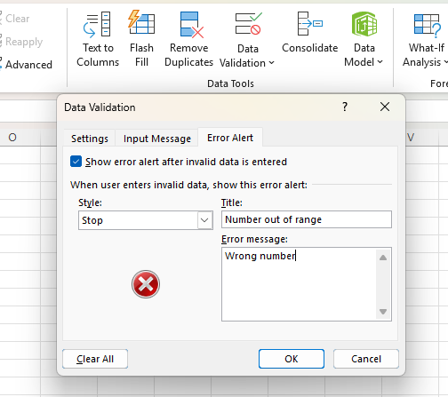

**Results:**

- When user selects cell B1:  
  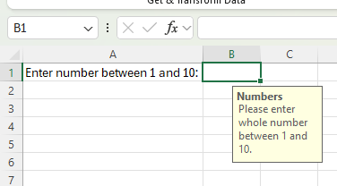
- When user enters number from range 1–10, everything is fine:  
  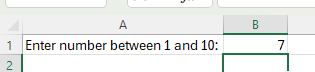
- When user enters number out of range:  
  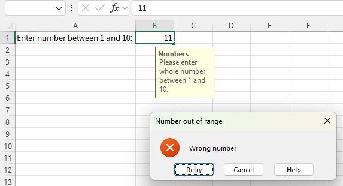

> 📝 **Tip:** To remove data validation from a cell, select the cell, go to Data tab → Data Validation, and click **Clear All**.

---

## 💰 Budget Limit Example

To avoid exceeding a budget limit in Excel, use data validation and the SUM function.

1. Select range **E2:E6** and click **Data Validation**.
2. In the Allow list, click **Custom**.
3. In the formula box enter:  
   ```excel
   =SUM($E$2:$E$6)<=80
   ```
   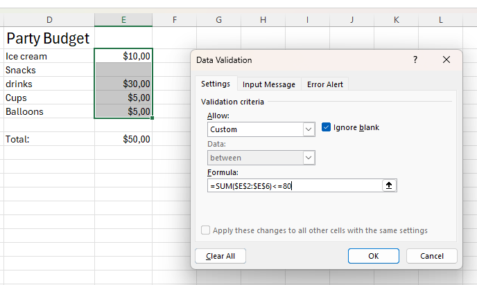

**Result when user exceeds budget:**  
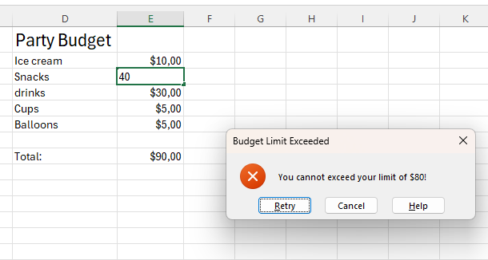

---

## 🚫 Prevent Duplicates Example

1. Select range **G2:G15** and click **Data Validation**.
2. In the Allow list, click **Custom**.
3. In the formula box enter:  
   ```excel
   =COUNTIF($G$2:$G$15;G2)=1
   ```
   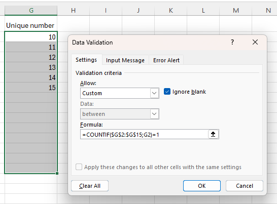

> ℹ️ **Note:** This formula ensures each value may occur only once in the selected range.

**Result:**  
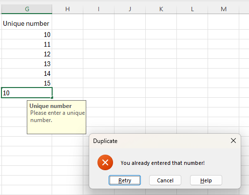

---

## 📋 Drop-down Lists

1. On the first sheet, type food names:  
   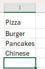
2. On the second sheet, select cell **B1**, then click **Data Validation**.
3. In the Allow box, click **List**.
4. Click in the Source box and select the range **I1:I4** on the first sheet.  
   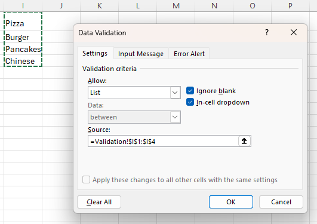
5. Click OK  
   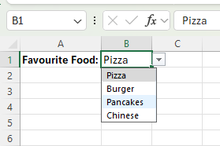

---

## 📷 Screenshots

You can find all screenshots in the `/Screenshots` folder.

---

## ℹ️ Requirements

- Microsoft Excel (recommended: 2021/365 for modern formulas)
- Windows OS

---

## 👨‍💻 Author

Project and documentation by **Kuba27x**  
Repository: [Kuba27x/Excel-4](https://github.com/Kuba27x/Excel-4)

---
